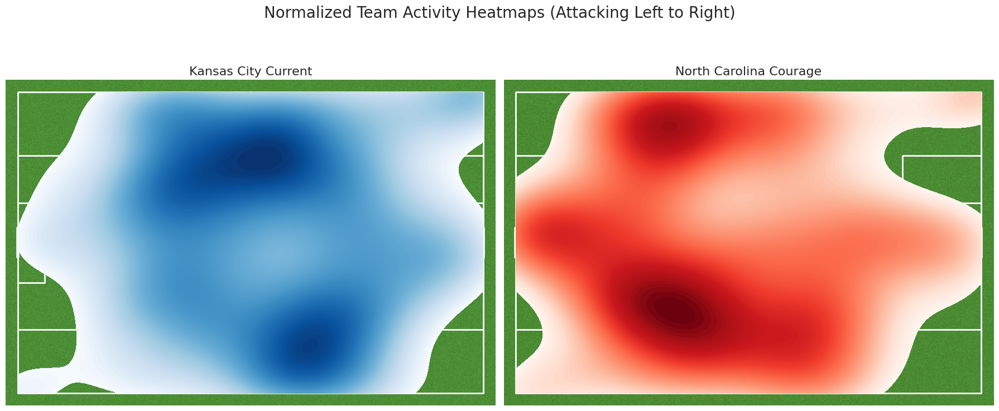

# Current vs Courage -- Patterns of Play

I looked at a heat map of the x,y location of playersFollowing our heatmap analysis, we successfully identified the most active zones ('hotspots') for each team and the key players who dominated those areas. This gives us a granular view of who was driving the play.

Key Findings:
Kansas City Current (Winner):

Hotspot Location: Their most active zone was in the central attacking midfield (normalized x: 40-60, y: 67-83), a critical area for creating offensive plays.
Key Players: The most influential players in this zone were L. LaBonta, K. Sharples, M. Cooper, Debinha, and C. Hutton.
Interpretation: This shows that Kansas City's midfield and attacking players controlled the most important part of the pitch for launching attacks, directly contributing to their offensive pressure and the 2-0 victory.
North Carolina Courage:

Hotspot Location: Their most active zone was much deeper, on their defensive right flank (normalized x: 20-40, y: 83-100).
Key Players: The players with the most events in this area were T. Lussi, C. Vine, M. Berkely, M. Bell, and R. Williams.
Interpretation: The fact that their hotspot was in a deeper, wide area suggests that much of their effort was spent in the build-up or defensive phases. This reinforces the earlier finding that they struggled to penetrate centrally and sustain pressure in the final third.




For Kansas City, their key attackers controlled the most valuable territory. For North Carolina, their key players were busiest in less threatening areas of the pitch.

### Key Players in the Kansas City Current's Hotspot
```
Name              Count
Lo'eau LaBonta    10
Kayla Sharples    8
Michelle Cooper   5
Debinha           4
Claire Hutton     4
```

### Key Players in the North Carolina Courage's Hotspot ---
```
Name              Count
Tyler Lussi       7
Cortnee Vine      6
Malia Berkely     5
Maycee Bell       5
Ryan Williams     5
```